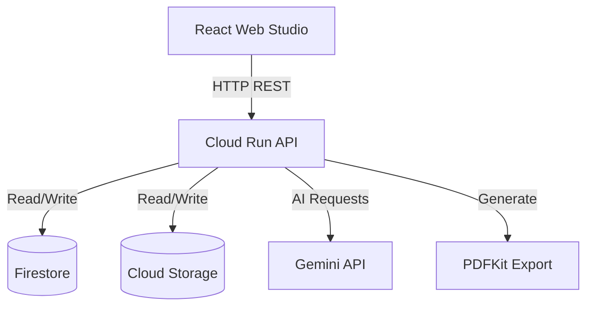

# ⚡ Fundable AI Architecture

This document outlines the system architecture for the Fundable AI platform, specifically tailored for the AIM Code Kitchen Season 01 submission.

## System Overview

## Component Responsibilities

- **core-types**: Shared TypeScript interfaces, enums, and Zod schemas used across both the API and Web clients. Ensures end-to-end type safety.
- **api**: Node.js Express server running on Cloud Run. Handles HTTP requests, orchestrates the AI pipelines, manages data persistence, and generates PDF exports.
- **web**: React + Vite frontend application. Provides the Web Studio interface for users to upload evidence, trigger AI generation, review evaluation scores, and download the final pitch.

## AI Provider Abstraction

To ensure flexibility across different deployment environments, the platform uses a `GeminiProvider` abstraction:
- **`GeminiProvider`**: The core interface defining how prompts are sent and responses received.
- **`VertexGeminiProvider`**: The primary implementation using `@google/genai` to interface with Vertex AI on Google Cloud. Includes fallback mechanisms (e.g., direct API key mode) for restrictive sandbox environments.

## AI Pipeline Stages

The generation process is broken down into modular pipelines:
- **ExtractionPipeline**: Analyzes raw evidence documents to extract 10 structured business vectors (problem, solution, market size, etc.).
- **GenerationPipeline**: Constructs a cohesive 10-slide pitch presentation based on the extracted intelligence. Enforces exactly 10 slides using structured outputs (Zod).
- **EvaluationPipeline**: Scores the generated slides across 4 dimensions: Completeness, Factual Consistency, Evidence Grounding, and Investor Readiness.
- **RegenerationPipeline**: Performs targeted, surgical refinement on specific slides that fall below a predefined quality threshold.

## Persistence Model

- **Firestore**: Primary NoSQL database for storing startup profiles, extracted intelligence, generated slides, and evaluation scores. An in-memory fallback is provided for local development without credentials.
- **Cloud Storage**: Object storage for securely holding raw evidence documents (PDFs, text) uploaded by users.

## Security Model

- **No Hardcoded Secrets**: Source code contains no credentials.
- **Environment Variables**: All configuration (project IDs, locations, API keys) is injected via environment variables.
- **Ignored Files**: `.gitignore` strictly prevents `.env` and `service-account*.json` files from being committed.
- **Cloud Run IAM**: Production deployments rely on Google Cloud IAM for secure service-to-service communication.

## Known Sandbox Constraints

- **Model Availability**: Vertex AI publisher models may be restricted in certain Qwiklabs environments; the API key fallback ensures the demo remains functional.
- **Authentication**: Firebase Authentication is intentionally excluded to allow seamless access during the demo.
- **Third-Party APIs**: Google Slides API is not connected.
- **Advanced RAG**: Vector Search is architected in principle but not deployed in the sandbox.

## Production Scaling Path

While the current architecture is optimized for the MVP and sandbox demonstration, the platform is designed to scale in the future:
- **Pub/Sub**: Would be introduced to decouple the Web API from long-running AI generation tasks.
- **Cloud Tasks**: Would manage rate limiting and retries for Gemini API calls.
- **Vector Search**: Would enable semantic retrieval over massive repositories of evidence documents (advanced RAG).
