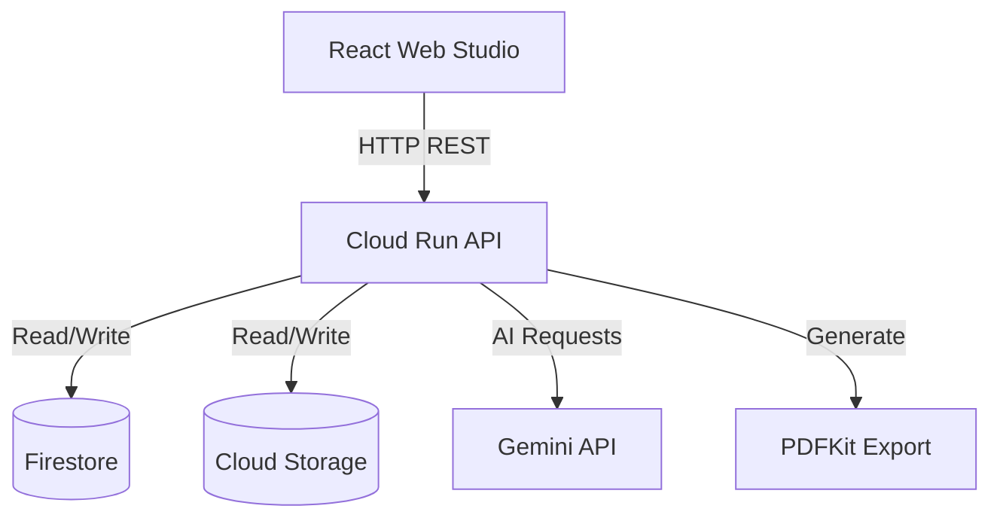

# ⚡ Fundable AI

> Cloud-native AI Pitch Intelligence Platform — AIM Code Kitchen Season 01, Google Cloud

Fundable AI transforms fragmented startup information into evidence-grounded, investment-ready pitch presentations using multi-stage AI reasoning on Google Cloud.

## Problem
Founders struggle to create investor presentations that accurately represent their business while meeting the expectations of venture capitalists. The process is often fragmented, time-consuming, and lacks a coherent narrative backed by hard evidence.

## Solution
Fundable AI provides an evidence-grounded AI pitch intelligence platform. By ingesting raw startup documents, our multi-stage AI pipeline extracts critical business vectors and generates a cohesive, evaluated, and precisely structured 10-slide pitch presentation.

## Architecture


## AI Pipeline
The AI generation process follows 7 discrete stages:
1. **Evidence Ingestion** (Cloud Storage / Memory Cache)
2. **Startup Intelligence Extraction** (Gemini → 10 business vectors)
3. **Founder Q&A Gap Resolution** (Gemini identifies gaps, founder provides answers to refine intelligence)
4. **Grounded Pitch Generation** (Gemini → exactly 10 slides grounded in refined intelligence)
5. **Quality Evaluation** (4-vector scoring engine)
6. **Targeted Regeneration** (surgical slide refinement via Gemini)
7. **Export** (binary PDF)

## Google Cloud Services
| Service | Purpose | Status |
|---|---|---|
| Cloud Run | Serverless API hosting | ✅ Live |
| Firestore | Startup profile persistence | ✅ Live |
| Cloud Storage | Evidence document storage | ✅ Live |
| Gemini (via @google/genai) | Multi-stage AI reasoning | ✅ Live |
| Cloud Logging | Request/error logging (via stdout) | ✅ Automatic |

## Key Engineering Decisions
- **Zod schemas enforce exactly 10 slides**: Ensures structural consistency for AI-generated output.
- **Provider abstraction**: A common `GeminiProvider` interface supports both Vertex AI and a direct API key mode for environment flexibility.
- **Deterministic fallbacks**: Robust error handling ensures the application remains functional even during temporary sandbox constraints.
- **4-dimensional evaluation**: Guarantees pitch quality by assessing multiple facets rather than relying on a single generic score.

## Evaluation Engine
The quality of generated pitches is evaluated across 4 vectors:
- **Completeness**: Does the pitch cover all necessary aspects of the startup?
- **Factual Consistency**: Are the claims logically sound and internally consistent?
- **Evidence Grounding**: Is the narrative supported by the ingested evidence documents?
- **Investor Readiness**: Does the tone and content align with venture capital expectations?

## Security
- No secrets are stored in the source code.
- Environment variables (`.env`) are used for all credentials.
- `.gitignore` prevents accidental commits of `.env` and `service-account*.json` files.
- Production relies on Cloud Run IAM for secure service-to-service communication.

## Local Development
```bash
npm install
npm run build
npm test
npm run dev --workspace=services/api
```

## API Endpoints
| Method | Path | Description |
|---|---|---|
| GET | `/api/startups` | List startup profiles |
| POST | `/api/startups` | Create a new startup profile |
| GET | `/api/startups/:id` | Get startup profile |
| POST | `/api/documents/:startupId` | Upload evidence document (PDF, TXT, MD) |
| POST | `/api/intelligence/:startupId/extract` | Extract 10 intelligence vectors |
| POST | `/api/intelligence/:startupId/questions` | Generate gaps-based interview questions |
| POST | `/api/intelligence/:startupId/answers` | Submit answers and refine intelligence |
| GET | `/api/pitches/:startupId` | Retrieve 10-slide deck |
| POST | `/api/pitches/:startupId/generate` | Generate pitch deck |
| GET | `/api/evaluations/:deckId` | Run 4-vector evaluation |
| POST | `/api/evaluations/:deckId/regenerate-slide` | Targeted slide regeneration |
| GET | `/api/exports/:deckId/pdf/download` | Download binary PDF |

## Demo Flow
The 7-step wizard user journey:
1. **Ingestion**: Upload a venture deck or paste venture text (e.g. AgroPulse).
2. **Venture Intelligence**: Extract 10 business vectors from the source text.
3. **Founder Q&A**: Gemini identifies gaps and asks structured questions; answers refine the context.
4. **Grounded Synthesis**: Synthesize exactly 10 Zod-enforced slides.
5. **Quality Gate**: Evaluate the deck across 4 key quality dimensions.
6. **Targeted Regen**: Surgically regenerate Slide 6/9 while preserving the other slides.
7. **Export**: Export the pitch to a binary PDF presentation.

## Known Sandbox Constraints
For the purposes of the Code Kitchen sandbox environment:
- Vertex AI publisher models may be unavailable in Qwiklabs; an API key fallback mode is active.
- Google Slides API integration is not connected in the sandbox.
- RAG/Vector Search is architected but not currently deployed in this environment.
- Firebase Authentication is not implemented (API endpoints are unauthenticated to ensure demo accessibility).
- Pub/Sub and Cloud Tasks, which are intended for production scaling, are not implemented in this MVP.

## Tech Stack
Node.js, TypeScript, Express, React, Vite, Zod, PDFKit, @google/genai, @google-cloud/firestore, @google-cloud/storage
